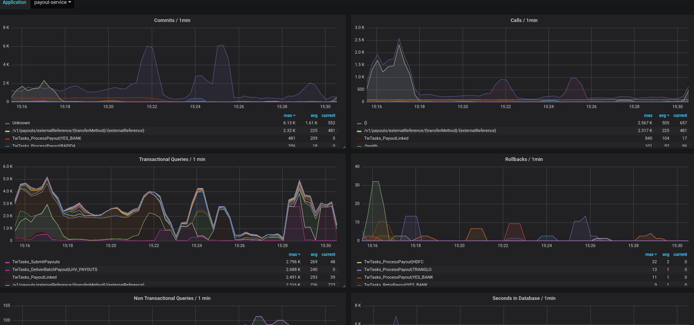

# EntryPoints
An Entry Point is usually some unit of work running in one thread.
For example, it can be a REST call, Quartz Job, TwTask.

EntryPointContext is a unified context for different entry points.

A REST call usually has a RequestContext (servlet request attributes), but Quartz Job does not have it.
So if you want to have for example per-execution cache, you usually need two different implementations for them.
That is where unified EntryPointContext comes into play.

## Database Access Statistics.

If you run into database performance problems, you would want to know, which part of the application is doing the most commits, the most queries
or just takes the most time in database. You would also want to know how efficient your entry points are, for example being interested in commits per call or
number of non-transactional queries per call.

This is what EntryPoints Database Access Statistics can help you with.

Just adding the dependency `compile 'com.transferwise.common:tw-entrypoints:<version>'` to your Spring Boot application while having Micrometer and SpyQl configured, 
database access statistics are started to be collected.

If you send your service's metrics to Prometheus you have everything ready to do neccessary analysis.

Statistics collected are listed in source code of `com.transferwise.common.entrypoints.databaseaccessstatistics.DatabaseAccessStatisticsEntryPointInterceptor`     

An example graph for service's statistics can be seen at https://grafana.tw.ee/d/NSWZKAvik/entrypoints-database-access?orgId=1



Why can't we use NewRelic for that? While it is possible (not easily though) to get those statistics per NewRelic transaction, NewRelic
does not allow to do queries like "Give me a list of transactions ordered by commits per call". 

You can also use Database Access Statistics in test code, for example to verify that your hibernate magic code does not have any N+1 problem:
```groovy
entryPoints.inEntryPointContext("bankAccountApi", {
	controller.findAll()

	def das = DatabaseAccessStatistics.get(EntryPoints.currentContext(), "masterdb")
	assert das.getNonTransactionalQueriesCount() == 0
	assert das.getCommitsCount() == 1
	assert das.getTransactionalQueriesCount() == 1
})
``` 

You can even use it in development as an XRebel alternative.
You can set the log level for `com.transferwise.common.entrypoints.databaseaccessstatistics` to DEBUG and every time an EntryPoint is executed,
the most important database access statistics are printed out.

You can even direct those specific logs to a separate file where you can filter/grep out EntryPoints you are interested in while manually testing application.

## Integrating a Service.
1. Add entrypoints dependency: `implementation 'com.transferwise.common:tw-entrypoints:<version>'`
2. Wrap your DataSource(s) to SpyqlDataSource, specifying a correct database name. "Reserved names":
* masterdb - our main database
* masterdb-ro - our main database read-only replica.

```java
SpyqlDataSource sqyqlDataSource = new SpyqlDataSource(hikariDataSource, "masterdb");
```

Sometimes, when you are not programmatically controlling the datasource creation, you can also use the following trick.
```java
@Bean
public BeanPostProcessor spyqlDataSourceBeanPostProcessor() {
    return new BeanPostProcessor() {
        @Override
        public Object postProcessAfterInitialization(Object bean, String beanName) throws BeansException {
            if (bean instanceof DataSource) {
                return new SpyqlDataSource((DataSource)bean, "masterdb");
            }
            return bean;
        }
    };
}
```

3. Make sure your service is registered in Prometheus and registers at least following common tag:
* app - your application name.

You can also optionally add:
* appnode - something identifying a node, maybe hostname.
